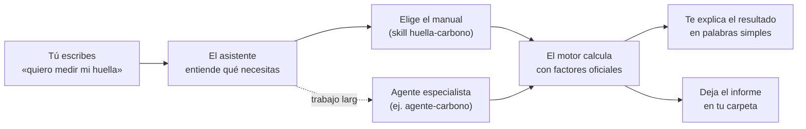

# Guía de uso

Para personas que **no** trabajan en tecnología. Si algo no se entiende,
escríbeselo al asistente: está hecho para explicar.

---

## 1. Qué es, en una frase

Un **asistente en español** que mide la huella de carbono de tu empresa, te dice
qué leyes te aplican, calcula plazos legales y te arma los reportes. Tú
conversas; él hace los cálculos y te deja los archivos listos en tu computador.

---

## 2. Cómo funciona por dentro (sin tecnicismos)

Piensa en una oficina con tres tipos de trabajo:

| Quién | Qué hace | Parecido a |
|---|---|---|
| **El asistente** | Conversa contigo, entiende lo que necesitas y decide cómo resolverlo | La persona que te atiende en la oficina |
| **Las skills** (36) | Manuales paso a paso para cada tema: huella, Ley Karin, reportes, Europa… | Los procedimientos escritos de la oficina |
| **Los agentes** (13) | Especialistas a los que el asistente les pasa trabajos largos | Los colegas expertos del segundo piso |
| **El motor de cálculo** | Hace **todos** los números con datos oficiales, sin internet | La calculadora certificada |

Lo que pasa cuando escribes algo:



**Tres reglas que nunca rompe:**

1. **Los números salen del motor**, no de la memoria del asistente. Cada factor
   dice de dónde viene, de qué año es y con qué licencia se puede usar.
2. **No inventa.** Si un dato no está verificado, lo dice. Si falta algo, te lo
   pide o lo marca como pendiente.
3. **Tus datos no salen de tu computador.** Todo queda en la carpeta `empresas/`.

---

## 3. Lo que necesitas la primera vez

1. **Claude instalado** en tu computador (Windows, Mac o Linux), con cuenta de
   pago: <https://claude.ai/download>. Claude Code viene incluido desde el plan
   Pro.
2. **La carpeta de Agentes ESG**: en <https://github.com/korredor07/agentes-esg>,
   botón verde **Code** → **Download ZIP**, y descomprímela en una ruta corta,
   por ejemplo `C:\agentes-esg` o `Documentos\agentes-esg`.
3. **Python**: si no lo tienes, el asistente te ofrece instalarlo la primera vez.
   Es gratis y oficial.

> **Ojo en Windows:** evita guardarla en carpetas muy profundas (por ejemplo,
> dentro de varias subcarpetas de OneDrive). Windows no acepta rutas de más de
> 260 caracteres y algunos informes no se podrían guardar. Si pasa, el
> asistente te lo dice y te explica cómo moverla.

---

## 4. Cómo empezar (3 pasos)

1. Abre **Claude** → pestaña **Code** → elige la carpeta `agentes-esg`.
2. Escribe **hola**.
3. Cuéntale a qué se dedica tu empresa. El asistente la registra con unas
   pocas preguntas simples.

> Hay una empresa de ejemplo, **Alimentos del Sur SpA**, con datos inventados,
> para que veas cómo se ve todo. **No cargues tus datos reales ahí**: registra
> tu propia empresa.

---

## 5. Qué le puedes pedir

Escribe con tus palabras. Estos son ejemplos que **se probaron de punta a punta**
con conversaciones simuladas (ver [prueba-e2e.md](prueba-e2e.md)).

### Medir

| Dile algo como… | Lo que obtienes |
|---|---|
| «Un cliente me pide la huella de carbono del 2025» | Te pide las boletas, llena las planillas por ti, calcula y te entrega el informe |
| «Tengo las boletas: luz enero 4.200 kWh, febrero…» | Las carga y calcula. *En la prueba, una panadería de Arequipa: 107,6 toneladas de CO2 al año, el 85 % por la harina* |
| «¿Cuánto emite mandar 12 toneladas de fruta a Rotterdam?» | Emisiones tramo por tramo. *En la prueba: 3.508 kg; el camión es el 3 % de los km pero el 19 % de las emisiones* |
| «¿Cuánta agua usamos y en zonas de estrés?» | Indicadores de agua para reportes |
| «Queremos bajar 42 % al 2030, ¿es creíble?» | Trayectoria año a año y qué falta para cumplirla |

### Cumplir

| Dile algo como… | Lo que obtienes |
|---|---|
| «¿Qué leyes me aplican?» | Las normas que te aplican, con plazos y riesgos, y lo que queda por confirmar |
| «Me llegó una denuncia de acoso el 1 de septiembre» | Todos los plazos legales exactos con feriados. *En la prueba avisó que dos plazos ya habían vencido el 4 de septiembre* |
| «Vendemos productos envasados, ¿qué nos pide la Ley REP?» | Metas de recolección y valorización del año |
| «¿Se rompió la cadena de frío?» + las temperaturas | Temperatura cinética media y excursiones. *En la prueba: 4 horas sobre −18 °C, máximo −13 °C* |
| «¿Cumple nuestro tranque de relaves?» | Revisión contra el DS 248, diciendo qué falta saber |
| «¿Cómo se deprecia esta camioneta para el SII?» | Vida útil, depreciación normal y acelerada |

### Reportar y comunicar

| Dile algo como… | Lo que obtienes |
|---|---|
| «Necesito un reporte VSME / GRI para un cliente» | Un borrador en Word con lo que ya tienes y lo que falta |
| «¿Podemos poner "100 % ecológicos" en el envase?» | Revisión anti-greenwashing, con alternativas que sí se pueden decir |
| «Pídeles los datos de emisiones a mis proveedores» | Carta y cuestionario listos, y a quién perseguir primero |
| «¿Qué nos va a pedir un verificador externo?» | Lista de revisión y brechas |
| «¿Cómo vamos? Resumen para el directorio» | Tablero de una página |

### Exportar a Europa

| Dile algo como… | Lo que obtienes |
|---|---|
| «Mi cliente europeo me pide un montón de datos, ¿qué me aplica?» | Qué te obliga de verdad y qué es solo exigencia del cliente. *En la prueba: a una exportadora de 85 personas no le aplican ni la CSRD ni la CSDDD directamente* |
| «¿Y si exportamos acero?» | Si el CBAM cubre el producto y si el importador queda bajo el umbral de 50 toneladas |

Si no sabes qué pedir, escribe **ayuda**.

---

## 6. Los agentes especialistas

No los tienes que llamar tú: el asistente los usa cuando el trabajo es largo o
especializado. Conviene saber que existen:

| Agente | Qué hace |
|---|---|
| `agente-datos` | Lee y ordena muchas boletas, facturas o planillas |
| `agente-carbono` | Calcula una huella completa de un año |
| `agente-auditor` | Revisa un reporte o una afirmación antes de que salga de la empresa |
| `agente-cumplimiento` | Revisión normativa a fondo en Chile o Perú |
| `agente-ley-karin` | Acompaña todo el procedimiento de una denuncia |
| `agente-reportes` | Redacta el borrador de una memoria o reporte |
| `agente-proveedores` | Pide y procesa los datos de la cadena de suministro |
| `agente-union-europea` | Revisa todo lo que Europa le exige a un exportador |
| `agente-mineria` | Seguridad y salud en faenas mineras |
| `agente-finanzas` | Activos fijos, depreciación y recambio de equipos |
| `agente-investigador` | Verifica un dato en la fuente oficial cuando puede haber cambiado |
| `agente-academia` | Capacita a una persona o a un equipo |
| `agente-crm` | Seguimiento comercial, si eres consultora |

---

## 7. Cómo conversar con el asistente

- Escribe como le escribirías a una persona: «no entiendo qué me piden», «¿esto
  es caro?», «explícamelo más simple».
- **Si te pregunta algo que no sabes, dile «no sé».** Es mejor que adivinar: lo
  deja como pendiente en vez de asumir un «no».
- Si algo no te cuadra, cuéntaselo: «marzo se ve muy alto».
- Puedes cerrar y volver mañana: todo queda guardado en tu carpeta.

---

## 8. Dónde queda todo

```
empresas/tu-empresa/
├── datos/           las planillas con tus datos
├── resultados/      los cálculos
├── reportes/        lo que puedes abrir, imprimir o enviar
├── evidencias/      los respaldos
└── seguimiento/     casos, metas y plazos en curso
```

- Los **.html** se abren con doble clic. Para enviarlos: ábrelos y usa
  Ctrl+P → «Guardar como PDF».
- Los **.docx** se abren en Word. Si pides un borrador nuevo, **no se pisa el
  anterior**: el nuevo queda como `-v2`.
- Los **.xlsx** se abren en Excel.

---

## 9. Lo que no hace y cuidados

- **Es orientación, no asesoría legal ni una auditoría.** Antes de presentar
  algo ante una autoridad o un cliente exigente, que lo revise un profesional.
- **No envía nada por ti** a organismos (SII, RETC, Dirección del Trabajo):
  prepara los archivos y el envío lo haces tú.
- **No firma electrónicamente** ni pone sellos de tiempo acreditados.
- **No trabaja con varias personas a la vez** sobre la misma empresa, ni se
  conecta a tu ERP: los datos se cargan desde planillas y documentos.
- **Haz copias de seguridad** de la carpeta `empresas/`.
- **Datos de personas** (sueldos, denuncias) son sensibles: guarda solo lo
  necesario y no compartas la carpeta completa.
- Si dice que no tiene un dato verificado, **créele**: es mejor que un número
  inventado.

---

## 10. Preguntas frecuentes

**¿Tengo que saber de computación?** No. Conversar y, a lo más, abrir una
planilla de Excel.

**¿Sirve para una empresa chica?** Sí. Está pensado para eso.

**¿Y si mis datos están incompletos?** Calcula con lo que hay, lo marca como
incompleto o estimado y te dice qué falta.

**¿Funciona para Perú?** Sí, con una salvedad que el asistente dice siempre:
para algunos combustibles usa factores de referencia internacionales o
chilenos, porque no hay uno oficial peruano cargado.

**¿Puedo usarlo para varias empresas?** Sí: cada una tiene su carpeta. Dile al
empezar con cuál trabajan hoy.

**¿Reemplaza a mi consultora?** No. Hace el trabajo repetitivo de medir, ordenar
y documentar. El criterio profesional sigue siendo necesario.

**¿Cómo lo actualizo?** Descarga la versión nueva y reemplaza la carpeta,
**conservando tu carpeta `empresas/`**.
